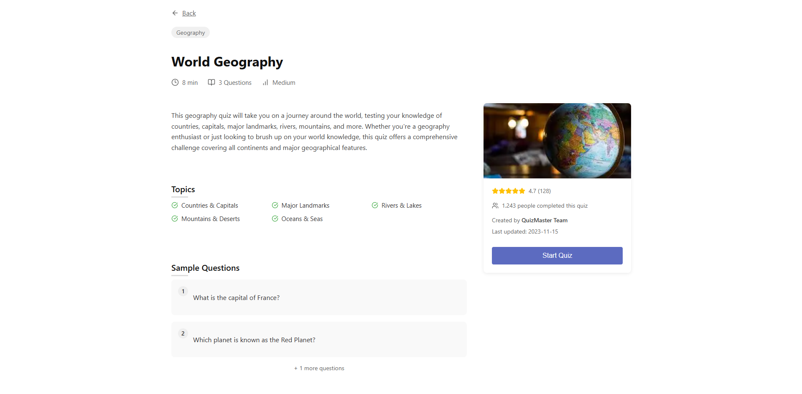
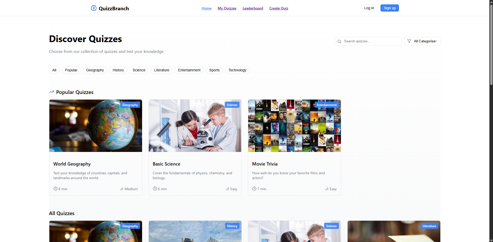

# QUIZZ BRANCH

### a page for the user to create and take quizzes in order to improve their knowledge

## technologies

-ReactJs (JSX, CSS, React-router-dom) - for front-end
-API (NodeJS, Firebase)

#PrtSc

